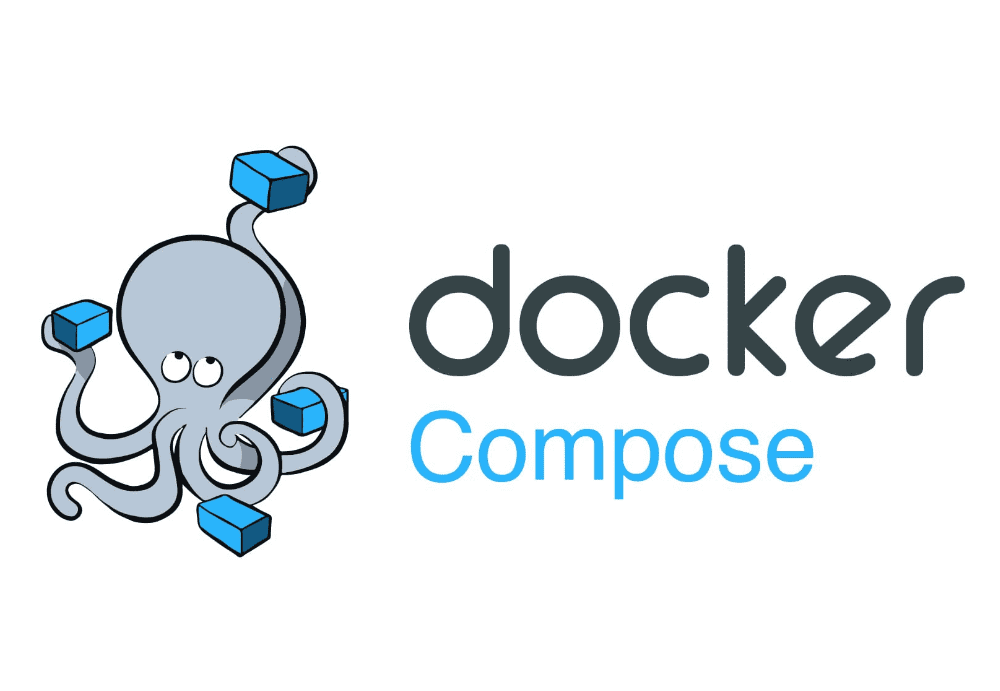

# :card_index_dividers: dockers-cluster

> Repositorio de todo lo que tiene desplegado el cluster



---

## Requisitos

### Montar disco

1) Obtener el UUID del disco a montar

    ```bash
    lsblk -o NAME,FSTYPE,UUID,MOUNTPOINTS
    ```

2) Crear la carpeta de destino del montaje

    ```bash
    mkdir /media/sda
    ```

3) Modificar el arhivo **/etc/fstab** y agregar lo siguiente

    ```bash
    UUID=<UUID> /media/sda ext4  defaults   0   0
    ```

4) Probar que todo funcione antes de reiniciar

    ```bash
    sudo findmnt --verify
    ```

---

## :grin: Autor

> **Brian Lobo**

* Github: [brianwolf](https://github.com/brianwolf)
* Docker Hub:  [brianwolf94](https://hub.docker.com/u/brianwolf94)
